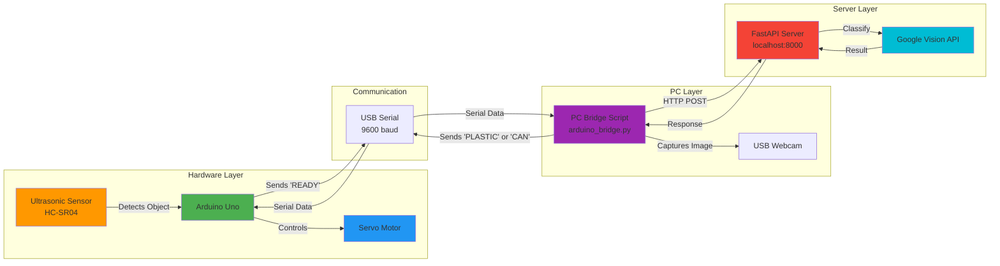
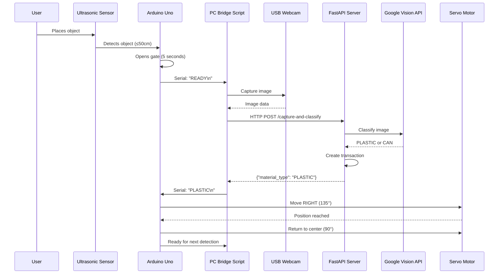
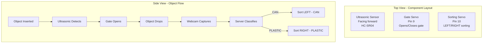
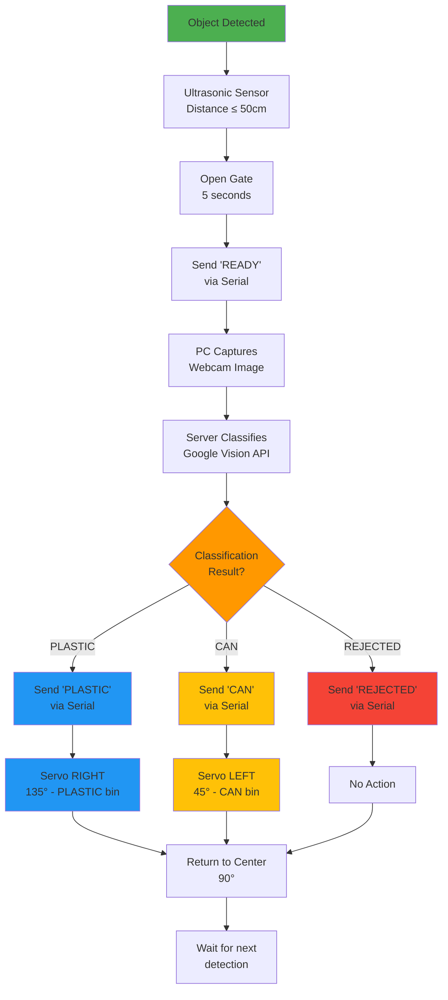
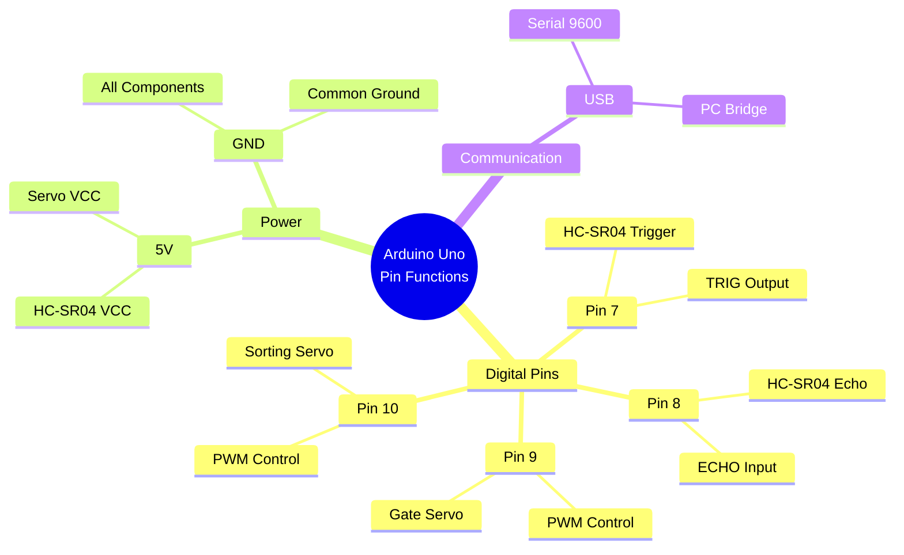
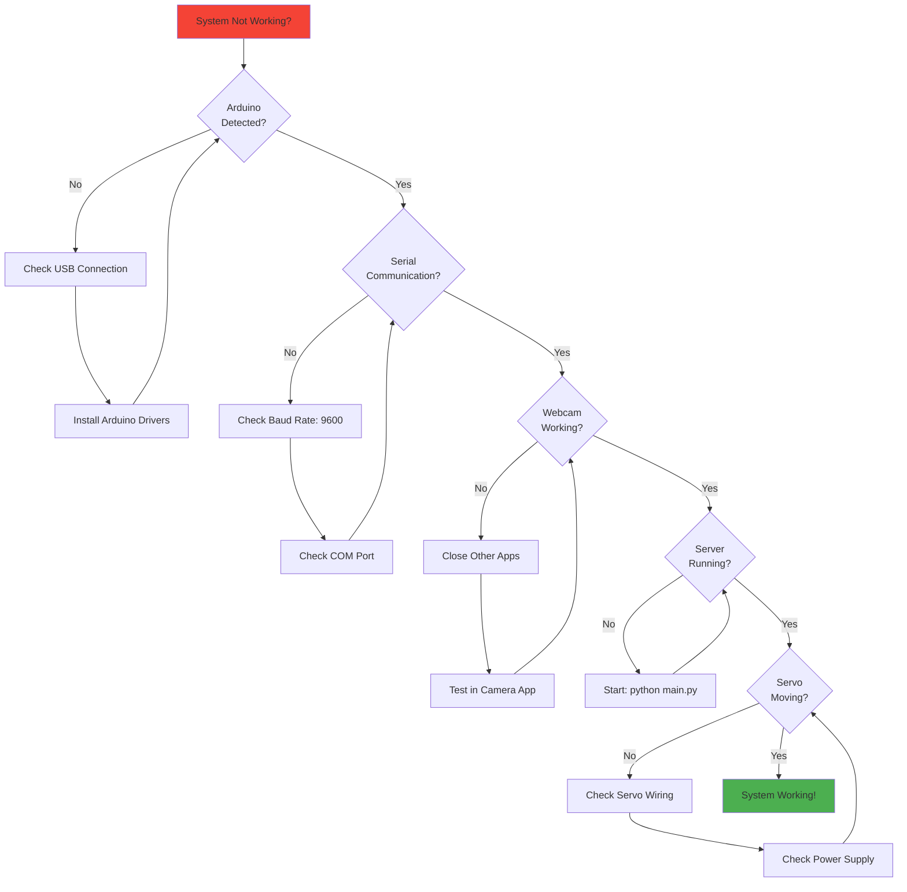

# Arduino Uno Wiring Guide

Complete pin connection guide for VendoTrash Arduino system.

## Pin Assignments

| Component | Connection | Arduino Pin |
|-----------|------------|-------------|
| HC-SR04 VCC | Power | 5V |
| HC-SR04 GND | Ground | GND |
| HC-SR04 TRIG | Trigger | Pin 7 |
| HC-SR04 ECHO | Echo | Pin 8 |
| Servo VCC | Power | 5V |
| Servo GND | Ground | GND |
| Servo Signal | Control | Pin 10 |
| Arduino USB | Data | PC USB Port |

## Wiring Diagram (Mermaid)

```mermaid
graph TB
    subgraph "Arduino Uno"
        A[Arduino Uno]
        P7[Pin 7 - TRIG]
        P8[Pin 8 - ECHO]
        P10[Pin 10 - Servo Signal]
        V5V[5V Power]
        GND[GND Ground]
        USB[USB Port]
    end
    
    subgraph "HC-SR04 Ultrasonic Sensor"
        H1[VCC]
        H2[TRIG]
        H3[ECHO]
        H4[GND]
    end
    
    subgraph "Servo Motor"
        S1[Red - VCC]
        S2[Yellow/Orange - Signal]
        S3[Black - GND]
    end
    
    subgraph "PC"
        PC[Computer USB Port]
    end
    
    P7 -->|Digital Output| H2
    P8 -->|Digital Input| H3
    P10 -->|PWM Signal| S2
    V5V -->|Power| H1
    V5V -->|Power| S1
    GND -->|Ground| H4
    GND -->|Ground| S3
    USB -->|Serial Communication| PC
    
    style A fill:#4CAF50,stroke:#333,stroke-width:3px
    style H1 fill:#FF9800,stroke:#333,stroke-width:2px
    style H2 fill:#FF9800,stroke:#333,stroke-width:2px
    style H3 fill:#FF9800,stroke:#333,stroke-width:2px
    style H4 fill:#FF9800,stroke:#333,stroke-width:2px
    style S1 fill:#2196F3,stroke:#333,stroke-width:2px
    style S2 fill:#2196F3,stroke:#333,stroke-width:2px
    style S3 fill:#2196F3,stroke:#333,stroke-width:2px
    style PC fill:#9C27B0,stroke:#333,stroke-width:2px
```

## Connection Flow Diagram



## Detailed Component Connections

### HC-SR04 Ultrasonic Sensor

```mermaid
graph LR
    subgraph "HC-SR04 Sensor"
        VCC[VCC - Pin 1]
        TRIG[TRIG - Pin 2]
        ECHO[ECHO - Pin 3]
        GND[GND - Pin 4]
    end
    
    subgraph "Arduino Uno"
        A5V[5V]
        A7[Pin 7]
        A8[Pin 8]
        AGND[GND]
    end
    
    VCC -->|Red Wire| A5V
    TRIG -->|Yellow Wire| A7
    ECHO -->|Green Wire| A8
    GND -->|Black Wire| AGND
    
    style VCC fill:#FF5722
    style TRIG fill:#FFC107
    style ECHO fill:#4CAF50
    style GND fill:#212121
```



### Servo Motor

```mermaid
graph LR
    subgraph "Servo Motor"
        SVCC[Red Wire - VCC]
        SSIG[Yellow/Orange - Signal]
        SGND[Black Wire - GND]
    end
    
    subgraph "Arduino Uno"
        A5V2[5V]
        A10[Pin 10]
        AGND2[GND]
    end
    
    SVCC -->|Power| A5V2
    SSIG -->|PWM Control| A10
    SGND -->|Ground| AGND2
    
    style SVCC fill:#F44336
    style SSIG fill:#FFC107
    style SGND fill:#212121
```



## System Architecture



## Physical Layout



## Power Distribution

```mermaid
graph TB
    subgraph "Power Source"
        USB_PWR[USB Power<br/>5V, 500mA]
    end
    
    subgraph "Arduino Uno"
        REG[5V Regulator]
        V5V[5V Pin]
        GND_PIN[GND Pin]
    end
    
    subgraph "Components"
        US_PWR[HC-SR04<br/>5V, ~15mA]
        SERVO_PWR[Servo Motor<br/>5V, ~100-500mA]
    end
    
    USB_PWR --> REG
    REG --> V5V
    V5V --> US_PWR
    V5V --> SERVO_PWR
    GND_PIN --> US_PWR
    GND_PIN --> SERVO_PWR
    
    style USB_PWR fill:#4CAF50
    style REG fill:#FF9800
    style V5V fill:#F44336
    style GND_PIN fill:#212121
```



## Sorting Logic



## Pin Functions Summary



## Troubleshooting Flow



## Quick Reference Card

### Pin Connections (One Page)

```
┌─────────────────────────────────────────┐
│         ARDUINO UNO PINOUT              │
├─────────────────────────────────────────┤
│                                         │
│  [5V] ──────► HC-SR04 VCC               │
│  [5V] ──────► Servo Red (VCC)          │
│                                         │
│  [GND] ─────► HC-SR04 GND               │
│  [GND] ─────► Servo Black (GND)        │
│                                         │
│  [Pin 7] ───► HC-SR04 TRIG             │
│  [Pin 8] ───► HC-SR04 ECHO             │
│  [Pin 10] ──► Servo Yellow (Signal)    │
│                                         │
│  [USB] ─────► PC (Serial Communication)│
│                                         │
└─────────────────────────────────────────┘
```

## Notes

- **Power**: Arduino USB provides 5V, 500mA. For high-torque servos, use external 5V power supply.
- **Ground**: Always connect all GND pins together (common ground).
- **Servo Signal**: Pin 10 uses PWM (Pulse Width Modulation) for servo control.
- **Serial**: USB connection uses 9600 baud rate for communication.
- **Detection Range**: Ultrasonic sensor detects objects within 50cm (configurable in code).

## Next Steps

1. ✅ Connect all wires according to diagram
2. ✅ Upload Arduino code
3. ✅ Test Serial communication
4. ✅ Run bridge script
5. ✅ Test full system

