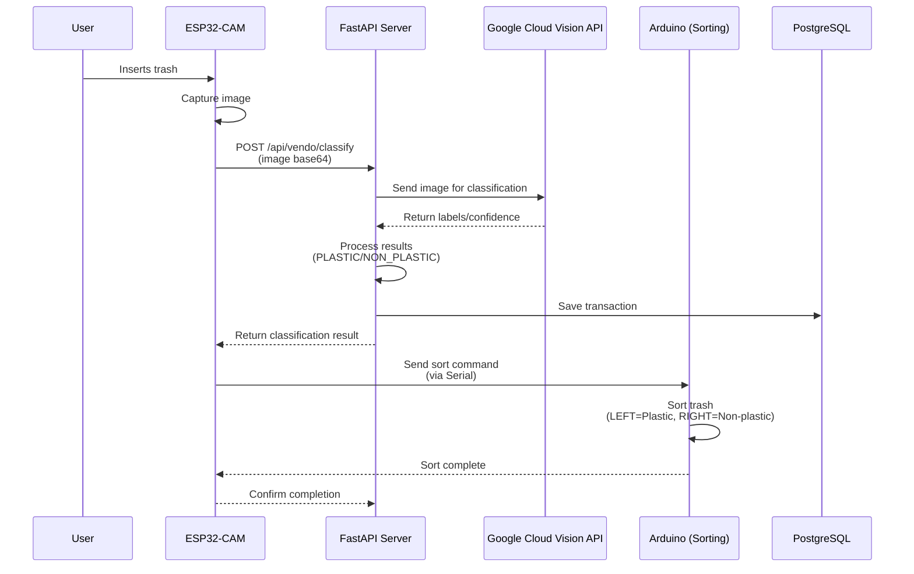

# ESP32-CAM Integration with Google Cloud Vision API

> **⚠️ FUTURE IMPLEMENTATION**  
> This document outlines the **future implementation plan** for integrating ESP32-CAM with Google Cloud Vision API.  
> This is **not currently implemented** in the production system.  
> The current system uses capacitive sensor-based detection (see `Arduino/vendo/vendo.ino`).

## Overview
This document outlines the complete integration plan for using ESP32-CAM with Google Cloud Vision API to accurately classify trash as PLASTIC or NON_PLASTIC. This is planned for future implementation to improve accuracy over the current sensor-based approach.

## Architecture



## System Flow (Event-Driven Design)

```
1. User inserts trash into machine
2. Ultrasonic sensor (Arduino) detects object within threshold (≤10cm)
3. Arduino sends "READY" signal to ESP32-CAM via Serial
4. ESP32-CAM captures image (JPEG) - ONLY when triggered
5. ESP32 sends image to FastAPI server (base64 encoded)
6. FastAPI receives image and sends to Google Cloud Vision API
7. Google Vision returns labels with confidence scores
8. FastAPI processes labels to determine: PLASTIC or NON_PLASTIC
9. FastAPI saves transaction to database
10. FastAPI returns classification to ESP32
11. ESP32 sends result (PLASTIC/NON_PLASTIC) back to Arduino via Serial
12. Arduino moves servo to correct bin (LEFT=Plastic, RIGHT=Non-plastic)
13. Servo returns to center position
```

### ⚡ Event-Driven Benefits
- ✅ **No polling** - Only captures when object detected
- ✅ **Saves API credits** - Calls API only when needed
- ✅ **Lower latency** - Immediate response to detection
- ✅ **Clean demo** - No random captures
- ✅ **Efficient** - Reduces CPU and network usage

## Project Structure

```
VendoTrash/
├── Arduino/
│   ├── vendo/              # Arduino sorting code (existing)
│   │   └── vendo.ino
│   └── esp32_cam/          # NEW: ESP32-CAM code
│       └── esp32_cam.ino
├── Server/
│   ├── routes/
│   │   └── vendo.py        # UPDATE: Add image classification endpoint
│   ├── controllers/
│   │   └── vendo_controller.py  # UPDATE: Add Google Vision integration
│   ├── services/
│   │   └── vision_service.py    # NEW: Google Vision API wrapper
│   ├── requirements.txt    # UPDATE: Add google-cloud-vision
│   └── config.py           # UPDATE: Add Google Cloud credentials
└── ESP32_CAM_INTEGRATION.md  # This file
```

## Implementation Steps

### Phase 1: Google Cloud Vision Setup

#### 1.1 Create Google Cloud Project
1. Go to [Google Cloud Console](https://console.cloud.google.com/)
2. Create new project: `vendotrash-vision`
3. Enable **Cloud Vision API**
4. Create **Service Account** with Vision API permissions
5. Download **JSON credentials file**

#### 1.2 Set Up Credentials
```bash
# Save credentials file
Server/google_vision_credentials.json

# Add to .env
GOOGLE_APPLICATION_CREDENTIALS=./google_vision_credentials.json
```

### Phase 2: Server-Side Implementation

#### 2.1 Install Dependencies
```bash
cd Server
pip install google-cloud-vision pillow
```

#### 2.2 Create Vision Service (`Server/services/vision_service.py`)
```python
from google.cloud import vision
from PIL import Image
import io
import base64
import logging

logger = logging.getLogger(__name__)

class VisionService:
    def __init__(self):
        self.client = vision.ImageAnnotatorClient()
    
    async def classify_trash(self, image_base64: str) -> dict:
        """Classify trash image using Google Cloud Vision API"""
        try:
            # Decode base64 image
            image_data = base64.b64decode(image_base64)
            image = vision.Image(content=image_data)
            
            # Perform label detection
            response = self.client.label_detection(image=image)
            labels = response.label_annotations
            
            # Process labels to determine material type
            result = self._process_labels(labels)
            
            return {
                "material_type": result["type"],
                "confidence": result["confidence"],
                "labels": [{"name": l.description, "score": l.score} for l in labels[:5]]
            }
        except Exception as e:
            logger.error(f"Vision API error: {str(e)}")
            raise
    
    def _process_labels(self, labels) -> dict:
        """Process Vision API labels to determine PLASTIC vs NON_PLASTIC"""
        # Keywords for plastic detection
        plastic_keywords = [
            "plastic", "bottle", "container", "bag", "packaging",
            "polyethylene", "polypropylene", "PET", "HDPE", "LDPE"
        ]
        
        # Keywords for non-plastic (paper, metal, organic)
        non_plastic_keywords = [
            "paper", "cardboard", "metal", "aluminum", "can",
            "organic", "food", "wood", "glass", "ceramic"
        ]
        
        plastic_score = 0
        non_plastic_score = 0
        
        for label in labels:
            label_name = label.description.lower()
            confidence = label.score
            
            # Check for plastic keywords
            if any(keyword in label_name for keyword in plastic_keywords):
                plastic_score += confidence
            
            # Check for non-plastic keywords
            if any(keyword in label_name for keyword in non_plastic_keywords):
                non_plastic_score += confidence
        
        # Determine result
        if plastic_score > non_plastic_score and plastic_score > 0.3:
            return {
                "type": "PLASTIC",
                "confidence": min(plastic_score, 1.0)
            }
        elif non_plastic_score > 0.3:
            return {
                "type": "NON_PLASTIC",
                "confidence": min(non_plastic_score, 1.0)
            }
        else:
            # Default to non-plastic if uncertain
            return {
                "type": "NON_PLASTIC",
                "confidence": 0.5
            }
```

#### 2.3 Update Vendo Controller (`Server/controllers/vendo_controller.py`)
```python
from services.vision_service import VisionService

vision_service = VisionService()

async def classify_trash_image(image_base64: str, user_id: int, machine_id: int) -> dict:
    """Classify trash image and create transaction"""
    try:
        # Classify using Google Vision
        classification = await vision_service.classify_trash(image_base64)
        
        # Calculate points (Plastic=2, Non-plastic=1)
        points = 2 if classification["material_type"] == "PLASTIC" else 1
        
        # Create transaction in database
        from db import SessionLocal
        from controllers.transaction_controller import create_transaction
        
        db = SessionLocal()
        transaction = create_transaction({
            "user_id": user_id,
            "machine_id": machine_id,
            "material_type": classification["material_type"],
            "points_earned": points
        }, db)
        
        return {
            "status": "success",
            "material_type": classification["material_type"],
            "confidence": classification["confidence"],
            "points_earned": points,
            "transaction_id": transaction.id
        }
    except Exception as e:
        logger.error(f"Error classifying trash: {str(e)}")
        raise
```

#### 2.4 Update Vendo Routes (`Server/routes/vendo.py`)
```python
from fastapi import APIRouter, Depends, HTTPException
from fastapi.security import HTTPBearer
from dependencies import get_current_user
from models import User
from schemas import VendoClassifyRequest, VendoClassifyResponse
from controllers.vendo_controller import classify_trash_image
import logging

router = APIRouter()
logger = logging.getLogger(__name__)

@router.post("/classify", response_model=VendoClassifyResponse)
async def classify_trash(
    request: VendoClassifyRequest,
    current_user: User = Depends(get_current_user)
):
    """Classify trash image using Google Cloud Vision"""
    try:
        result = await classify_trash_image(
            image_base64=request.image_base64,
            user_id=current_user.id,
            machine_id=request.machine_id
        )
        
        return VendoClassifyResponse(**result)
    except Exception as e:
        logger.error(f"Classification error: {str(e)}")
        raise HTTPException(status_code=500, detail=str(e))
```

#### 2.5 Update Schemas (`Server/schemas.py`)
```python
class VendoClassifyRequest(BaseModel):
    """Request schema for trash classification"""
    image_base64: str  # Base64 encoded JPEG image
    machine_id: int = 1  # Default machine

class VendoClassifyResponse(BaseModel):
    """Response schema for trash classification"""
    status: str
    material_type: str  # PLASTIC or NON_PLASTIC
    confidence: float
    points_earned: int
    transaction_id: int
```

### Phase 3: ESP32-CAM Implementation

#### 3.1 ESP32-CAM Code (`Arduino/esp32_cam/esp32_cam.ino`)
```cpp
#include "esp_camera.h"
#include <WiFi.h>
#include <HTTPClient.h>
#include <ArduinoJson.h>
#include <base64.h>

// WiFi credentials
const char* ssid = "YOUR_WIFI_SSID";
const char* password = "YOUR_WIFI_PASSWORD";

// FastAPI server URL
const char* serverUrl = "http://YOUR_SERVER_IP:8000/api/vendo/classify";
const char* authToken = "YOUR_JWT_TOKEN"; // Get from login endpoint

// Camera pins (ESP32-CAM AI-Thinker)
#define PWDN_GPIO_NUM     32
#define RESET_GPIO_NUM    -1
#define XCLK_GPIO_NUM      0
#define SIOD_GPIO_NUM     26
#define SIOC_GPIO_NUM     27
#define Y9_GPIO_NUM       35
#define Y8_GPIO_NUM       34
#define Y7_GPIO_NUM       39
#define Y6_GPIO_NUM       36
#define Y5_GPIO_NUM       21
#define Y4_GPIO_NUM       19
#define Y3_GPIO_NUM       18
#define Y2_GPIO_NUM        5
#define VSYNC_GPIO_NUM    25
#define HREF_GPIO_NUM     23
#define PCLK_GPIO_NUM     22

// Serial communication with Arduino
#define ARDUINO_RX 4
#define ARDUINO_TX 2

void setup() {
  Serial.begin(115200);
  Serial2.begin(9600, SERIAL_8N1, ARDUINO_RX, ARDUINO_TX); // For Arduino communication
  
  // Initialize camera
  camera_config_t config;
  config.ledc_channel = LEDC_CHANNEL_0;
  config.ledc_timer = LEDC_TIMER_0;
  config.pin_d0 = Y2_GPIO_NUM;
  config.pin_d1 = Y3_GPIO_NUM;
  config.pin_d2 = Y4_GPIO_NUM;
  config.pin_d3 = Y5_GPIO_NUM;
  config.pin_d4 = Y6_GPIO_NUM;
  config.pin_d5 = Y7_GPIO_NUM;
  config.pin_d6 = Y8_GPIO_NUM;
  config.pin_d7 = Y9_GPIO_NUM;
  config.pin_xclk = XCLK_GPIO_NUM;
  config.pin_pclk = PCLK_GPIO_NUM;
  config.pin_vsync = VSYNC_GPIO_NUM;
  config.pin_href = HREF_GPIO_NUM;
  config.pin_sscb_sda = SIOD_GPIO_NUM;
  config.pin_sscb_scl = SIOC_GPIO_NUM;
  config.pin_pwdn = PWDN_GPIO_NUM;
  config.pin_reset = RESET_GPIO_NUM;
  config.xclk_freq_hz = 20000000;
  config.pixel_format = PIXFORMAT_JPEG;
  config.frame_size = FRAMESIZE_VGA; // 640x480
  config.jpeg_quality = 12;
  config.fb_count = 1;

  // Initialize camera
  esp_err_t err = esp_camera_init(&config);
  if (err != ESP_OK) {
    Serial.printf("Camera init failed with error 0x%x", err);
    return;
  }

  // Connect to WiFi
  WiFi.begin(ssid, password);
  while (WiFi.status() != WL_CONNECTED) {
    delay(500);
    Serial.print(".");
  }
  Serial.println("\nWiFi connected!");
  Serial.print("IP address: ");
  Serial.println(WiFi.localIP());
}

void loop() {
  // ⚡ EVENT-DRIVEN: Wait for "READY" signal from Arduino (ultrasonic trigger)
  if (Serial2.available() > 0) {
    String msg = Serial2.readStringUntil('\n');
    msg.trim();
    
    if (msg == "READY") {
      Serial.println("📸 Object detected! Capturing image...");
      
      // Capture image
      camera_fb_t * fb = esp_camera_fb_get();
      if (!fb) {
        Serial.println("❌ Camera capture failed");
        Serial2.println("ERROR"); // Notify Arduino of failure
        return;
      }

      Serial.printf("✅ Image captured: %d bytes\n", fb->len);
      
      // Encode image to base64
      String imageBase64 = base64::encode((uint8_t*)fb->buf, fb->len);
      
      // Send to FastAPI server
      HTTPClient http;
      http.begin(serverUrl);
      http.addHeader("Content-Type", "application/json");
      http.addHeader("Authorization", "Bearer " + String(authToken));
      
      // Create JSON payload
      DynamicJsonDocument doc(8192); // Larger for base64 image
      doc["image_base64"] = imageBase64;
      doc["machine_id"] = 1;
      
      String jsonPayload;
      serializeJson(doc, jsonPayload);
      
      Serial.println("🌐 Sending to server...");
      int httpResponseCode = http.POST(jsonPayload);
      
      if (httpResponseCode == 200) {
        String response = http.getString();
        
        // Parse response
        DynamicJsonDocument responseDoc(1024);
        deserializeJson(responseDoc, response);
        
        String status = responseDoc["status"];
        String materialType = responseDoc["material_type"];
        int points = responseDoc["points_earned"];
        
        Serial.printf("✅ Classification: %s, Points: %d\n", materialType.c_str(), points);
        
        // Send result back to Arduino (PLASTIC or NON_PLASTIC)
        if (status == "success") {
          Serial2.println(materialType); // Send PLASTIC or NON_PLASTIC
        } else {
          Serial2.println("REJECTED"); // Item not accepted
        }
        
      } else {
        Serial.printf("❌ HTTP Error: %d\n", httpResponseCode);
        String error = http.getString();
        Serial.println(error);
        Serial2.println("ERROR"); // Notify Arduino of API error
      }
      
      http.end();
      esp_camera_fb_return(fb);
    }
  }
  
  delay(50); // Small delay to prevent CPU spinning
}
```

### Phase 4: Arduino Integration

#### 4.1 Update Arduino Code (`Arduino/vendo/vendo.ino`)
```cpp
#include <Servo.h>

#define SERVO_PIN 9
#define TRIG_PIN 10
#define ECHO_PIN 11

#define DETECTION_THRESHOLD_CM 10  // Object detection distance
#define SERVO_LEFT_POS 30          // Plastic bin (LEFT)
#define SERVO_RIGHT_POS 150        // Non-plastic bin (RIGHT)
#define SERVO_CENTER_POS 90         // Neutral position

Servo binServo;
bool readySent = false;

long getDistanceCM() {
  digitalWrite(TRIG_PIN, LOW);
  delayMicroseconds(2);
  digitalWrite(TRIG_PIN, HIGH);
  delayMicroseconds(10);
  digitalWrite(TRIG_PIN, LOW);
  
  long duration = pulseIn(ECHO_PIN, HIGH, 30000); // 30ms timeout
  if (duration == 0) return 999; // No echo = far away
  
  return duration * 0.034 / 2; // Convert to cm
}

void setup() {
  Serial.begin(9600); // Hardware Serial for ESP32 communication
  
  pinMode(TRIG_PIN, OUTPUT);
  pinMode(ECHO_PIN, INPUT);
  
  binServo.attach(SERVO_PIN);
  binServo.write(SERVO_CENTER_POS); // Start at neutral
  
  Serial.println("🚀 VendoTrash System Ready");
  Serial.println("Waiting for object detection...");
}

void loop() {
  // 1️⃣ Check ultrasonic sensor for object detection
  long distance = getDistanceCM();
  
  // 2️⃣ If object detected and haven't sent READY yet
  if (distance <= DETECTION_THRESHOLD_CM && !readySent) {
    Serial.println("📦 Object detected! Sending READY to ESP32...");
    Serial.println("READY"); // 🔥 Trigger ESP32-CAM via Serial
    readySent = true;
  }
  
  // 3️⃣ Wait for classification result from ESP32
  if (Serial.available() > 0) {
    String result = Serial.readStringUntil('\n');
    result.trim();
    
    Serial.print("📥 Received result: ");
    Serial.println(result);
    
    // 4️⃣ Move servo based on classification
    if (result == "PLASTIC") {
      Serial.println("♻️ PLASTIC -> Moving to LEFT bin");
      binServo.write(SERVO_LEFT_POS);
      delay(2000); // Hold position
      binServo.write(SERVO_CENTER_POS);
      
    } else if (result == "NON_PLASTIC") {
      Serial.println("🔩 NON-PLASTIC -> Moving to RIGHT bin");
      binServo.write(SERVO_RIGHT_POS);
      delay(2000); // Hold position
      binServo.write(SERVO_CENTER_POS);
      
    } else if (result == "REJECTED") {
      Serial.println("❌ Item REJECTED - No sorting");
      // Don't move servo, item not accepted
      
    } else if (result == "ERROR") {
      Serial.println("⚠️ ERROR from ESP32 - Retry needed");
    }
    
    // Reset for next detection
    readySent = false;
    delay(500); // Brief pause before next cycle
  }
  
  delay(200); // Small delay to prevent CPU spinning
}
```

## Configuration

### Environment Variables (`Server/.env`)
```env
# Google Cloud Vision
GOOGLE_APPLICATION_CREDENTIALS=./google_vision_credentials.json

# ESP32 Configuration
ESP32_IP=192.168.1.100
ESP32_PORT=80

# Existing variables
DATABASE_URL=postgresql://...
SECRET_KEY=...
```

### ESP32 Configuration
```cpp
// Update these in esp32_cam.ino
const char* ssid = "YOUR_WIFI_SSID";
const char* password = "YOUR_WIFI_PASSWORD";
const char* serverUrl = "http://YOUR_SERVER_IP:8000/api/vendo/classify";
```

## Testing Plan

### 1. Test Google Vision API
```bash
# Test with sample image
python Server/test_vision.py
```

### 2. Test ESP32-CAM
- Verify camera initialization
- Test WiFi connection
- Test image capture
- Test HTTP POST to server

### 3. Test Full Flow
1. Insert trash item
2. ESP32 captures image
3. Image sent to server
4. Server classifies using Google Vision
5. Server returns result
6. ESP32 sends command to Arduino
7. Arduino sorts trash

## Cost Estimation

### Google Cloud Vision API Pricing
- **First 1,000 units/month**: FREE
- **1,001 - 5,000,000 units/month**: $1.50 per 1,000 units
- **Example**: 1,000 classifications = $0 (free tier)
- **Example**: 10,000 classifications = ~$13.50/month

### Estimated Monthly Cost
- **Low usage** (1,000-5,000): FREE to ~$6/month
- **Medium usage** (10,000-50,000): ~$13.50 - $67.50/month
- **High usage** (100,000+): ~$135+/month

## Security Considerations

1. **API Key Security**
   - Store credentials in `.env` (not in code)
   - Use service account with minimal permissions
   - Rotate credentials regularly

2. **Image Privacy**
   - Images are sent to Google Cloud (check privacy policy)
   - Consider image deletion after processing
   - Add user consent if needed

3. **Network Security**
   - Use HTTPS for production
   - Secure WiFi network
   - Authenticate ESP32 requests

## Deployment Checklist

- [ ] Create Google Cloud project
- [ ] Enable Vision API
- [ ] Create service account
- [ ] Download credentials JSON
- [ ] Install `google-cloud-vision` package
- [ ] Update `requirements.txt`
- [ ] Create `vision_service.py`
- [ ] Update `vendo_controller.py`
- [ ] Update `vendo.py` routes
- [ ] Update schemas
- [ ] Flash ESP32-CAM code
- [ ] Configure WiFi credentials
- [ ] Test image capture
- [ ] Test API integration
- [ ] Test full flow
- [ ] Deploy to production

## Troubleshooting

### Common Issues

1. **Camera not initializing**
   - Check pin connections
   - Verify camera module compatibility
   - Check power supply (needs 5V, 2A)
   - Ensure camera module is properly seated

2. **WiFi connection failed**
   - Verify SSID and password
   - Check signal strength
   - Ensure 2.4GHz network (ESP32 doesn't support 5GHz)
   - Check router firewall settings

3. **Google Vision API errors**
   - Verify credentials file path
   - Check API is enabled
   - Verify service account permissions
   - Check billing is enabled
   - Ensure JWT token is valid

4. **Image too large**
   - Reduce JPEG quality (lower number = smaller file, e.g., 10-12)
   - Reduce frame size (FRAMESIZE_QVGA instead of VGA)
   - Compress image before base64 encoding

5. **Ultrasonic sensor not detecting**
   - Check wiring (VCC, GND, TRIG, ECHO)
   - Verify threshold distance (try 8-15cm)
   - Test sensor with Serial.println(distance)
   - Ensure object is within detection range

6. **Serial communication not working**
   - Verify TX/RX connections are crossed (ESP32 TX → Arduino RX)
   - Check baud rate matches (9600 on both)
   - Ensure common GND connection
   - Keep wires short (<30cm) to reduce noise

7. **Servo not moving**
   - Check 5V power supply (servo needs adequate current)
   - Verify signal wire on correct pin
   - Test with simple servo.write() command
   - Add 100µF capacitor across servo power if jittery

8. **ESP32 not receiving "READY" signal**
   - Check Serial2.begin() parameters match
   - Verify Serial2.available() is being checked
   - Test with Serial2.println("TEST") from Arduino
   - Ensure Serial2 is reading correctly

## Status: Future Implementation

**Current Status**: 📋 **PLANNED** - Not yet implemented  
**Priority**: Medium  
**Estimated Implementation Time**: 2-3 weeks  
**Dependencies**: 
- Google Cloud Vision API setup
- ESP32-CAM hardware acquisition
- Testing and validation

## Next Steps (When Ready to Implement)

1. **Immediate**: Set up Google Cloud Vision API
2. **Week 1**: Implement server-side vision service
3. **Week 2**: Implement ESP32-CAM code
4. **Week 3**: Integration testing
5. **Week 4**: Production deployment

## Current System

The current production system uses:
- **Arduino** with capacitive sensor (`Arduino/vendo/vendo.ino`)
- Simple HIGH/LOW detection for plastic vs non-plastic
- Lower accuracy (~60-70%) but simpler implementation

## References

- [Google Cloud Vision API Docs](https://cloud.google.com/vision/docs)
- [ESP32-CAM Guide](https://randomnerdtutorials.com/esp32-cam-ai-thinker-pinout/)
- [FastAPI File Upload](https://fastapi.tiangolo.com/tutorial/request-files/)

